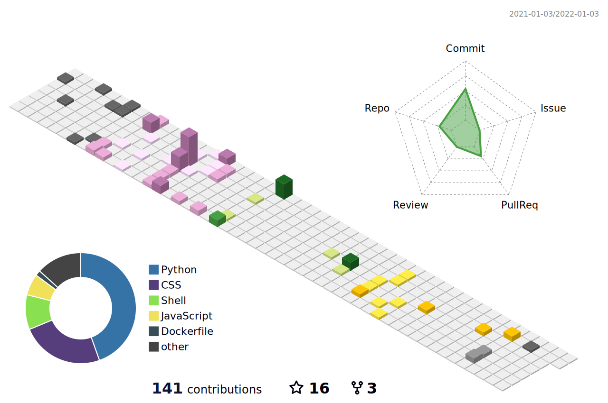

### Hi there 👋

- 💻 My website's [link](https://spider-man-tm.github.io/).
- 🔭 I’m currently working as a Data Engineer.

<strong>Profile views counter</strong>
&emsp;

 
<!--
### My Qiita profile
  
-->

### GitHub Sammary

<!--  -->
<!--

 -->
